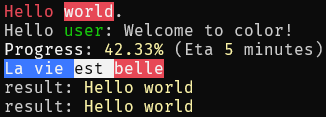

# Colored Printf


[](https://ci.appveyor.com/project/vbfox/coloredprintf/branch/master)
[](https://travis-ci.org/vbfox/ColoredPrintf)
[](https://vbfox.visualstudio.com/ColoredPrintf/_build/latest?definitionId=5&branchName=master)
[](https://www.nuget.org/packages/BlackFox.ColoredPrintf)

This library provide a replacement to F# `printf` function with color support.

The syntax to set the color inside the string is `$foreground;background[text]` where both foreground and background are optional.

## Examples

```fsharp
colorprintfn "Hello $red[world]."
colorprintfn "Hello $green[%s]." "user"
colorprintfn "$white[Progress]: $yellow[%.2f%%] (Eta $yellow[%i] minutes)" 42.33 5
colorprintfn "$white;blue[%s ]$black;white[%s ]$white;red[%s]" "La vie" "est" "belle"
```

Displays :



## Thanks

* [Newaita icon pack](https://github.com/cbrnix/Newaita) for the base of the icon (License: [CC BY-NC-SA 3.0]
